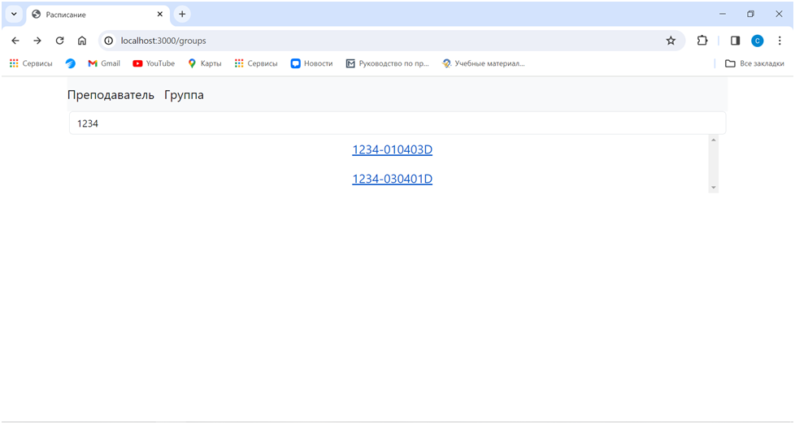
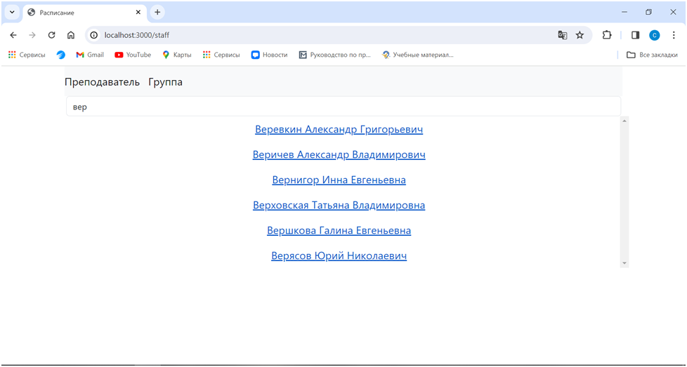
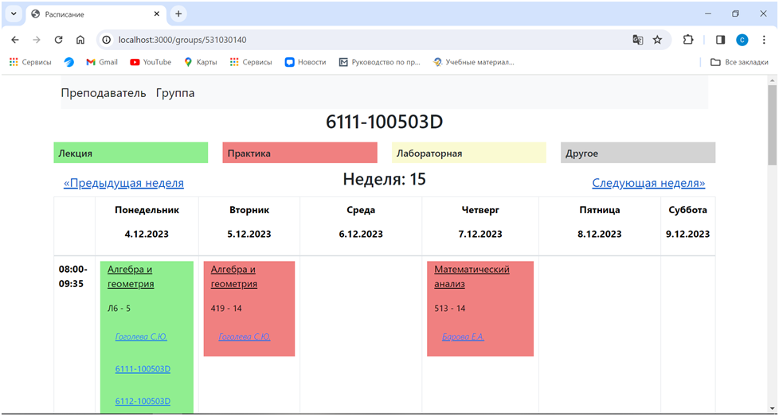
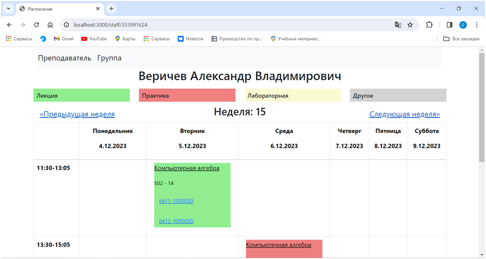

{**Расписание** 
1. Возможность поиска группы по номеру

2. Возможность поиска преподавателя по фамилии

3. Расписание группы:
    - Возможность переключения учебной недели, возможность перейти на страницу с расписанием преподавателя

4. Расписание преподавателя:
    - Возможность переключения учебной недели, возможность перейти на стринцу с расписанием группы
}
{**Требования:**
1. СУБД PostgreSQL 16.0}
{**Инструкция по запуску:**
1. В файле database/db-config.json изменить пароль пользователя postgres (или задать любого пользователя, имеющего права на создание базы данных)
2. Запустить сервер командой 
    - `node websec-2/server/server.js`
    *Дождаться, пока сервер начнет слушать подключения*
    **Возможно потребуется установить пакет cors в папке server и пакет sequelize в папке database**
    - команда `npm install cors`
    - команда `npm install sequelize`
3. Запустить клиент из папки websec-2/client/ командой 
    - `npm run start`
    **Возможно потребуется установить пакет react-scripts в папке client**
    - команда `npm install react-scripts`
}